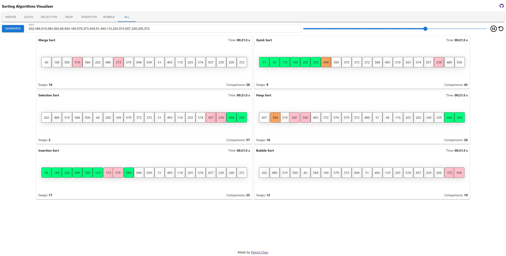

# Sorting Visualizer

A [Sorting Visualizer](https://paperpatch.github.io/sorting_visualizer/) project that displays various sorting algorithms. Users are able to generate their own input of arrays to test out algorithms.

## Table of Contents

* [Setup](#setup)
* [Usage](#usage)
* [Deployment](#deployment)
* [Contributing](#contributing)
* [License](#license)

## Setup
:floppy_disk:

This app uses the following npm:
- [zustand](https://www.npmjs.com/package/zustand)
  - A small, fast and scalable bearbones state-management solution using simplified flux principles. Has a comfy api based on hooks, isn't boilerplatey or opinionated.
  - Zustand uses an external store, and it provides some Hooks to connect the external.
- [@emotion/react](https://www.npmjs.com/package/@emotion/react)
  - Simple styling in React
- [@emotion/styled](https://www.npmjs.com/package/@emotion/styled)
  - The styled API for @emotion/react
- [@material-ui/core](https://www.npmjs.com/package/@material-ui/core)
  [@material-ui/styles](https://www.npmjs.com/package/@material-ui/core)
  [@material-ui/system](https://www.npmjs.com/package/@material-ui/core)
  - Material-UI components
- [gh-pages](https://www.npmjs.com/package/gh-pages)
  - Publish files to a gh-pages branch on GitHub (or any other branch anywhere else).

Type `npm install` to download the dependencies and `npm start` to run the application.

Type `npm deploy` if you're planning on hosting on gh-pages.

## Usage

:computer:

Go to [Sorting Visualizer](https://paperpatch.github.io/sorting_visualizer/) and navigate through Sorting Algorithm choices of Merge, Quick, Selection, Heap, Insertion and Bubble Sort.

Either randomly generate inputs by clicking on the `Generate` button or manually insert your own inputs.

Users are able to hit the pause or play button to stop or start the algorithm.

## Deployment

Server is deployed on gh-pages. See deployed link to experience the sorting visualizer.

[Deployed link to Sorting Algorithms Visualizer](https://paperpatch.github.io/sorting_visualizer/)

## Contributing

:octocat:

[paperpatch](https://github.com/paperpatch)  

## License

:receipt:

This project is licensed under MIT.